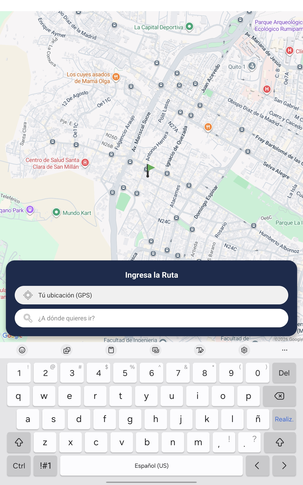
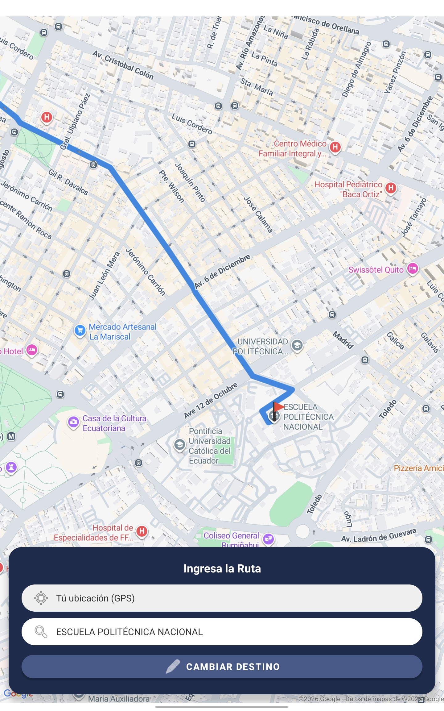

# CP-01: Ingreso y validación de coordenadas

## 1. Definición del Caso de Prueba

| Campo | Descripción |
| :--- | :--- |
| **ID** | CP-01 |
| **Historia de Usuario** | HU-01 |
| **Nombre** | Ingreso y validación de coordenadas |
| **Cumple (Sí/No)** | Sí |
| **Descripción de la Prueba** | Verificar que el usuario pueda seleccionar punto de destino y que el sistema valide que se encuentren dentro del área de cobertura (Quito). |
| **Precondiciones** | Aplicación Android ejecutándose; acceso a internet y servicios de ubicación habilitados. |
| **Datos de Prueba** | Punto de destino: EPN (-0.2106, -78.4889) |
| **Resultados Esperados** | Los campos de texto de la interfaz se actualizan automáticamente con las direcciones/coordenadas seleccionadas y se muestran marcadores visuales en el mapa. |
| **Resultados Obtenidos** | Los puntos se registraron en la interfaz de Kotlin sin retraso y los marcadores se fijaron correctamente en las ubicaciones especificadas. |

---

## 2. Evidencia de Ejecución

**Paso 1:** Abrir la pantalla de Ruteo.

**Paso 2:** Definir el destino.

