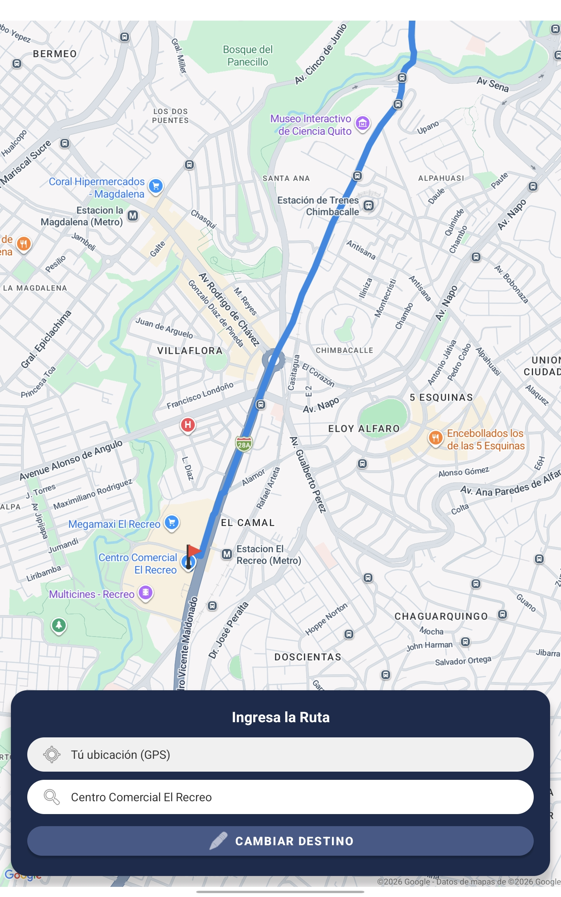
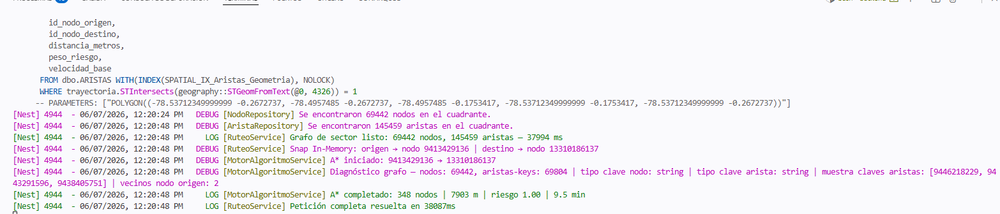

# CP-02: Generación algorítmica de la ruta segura

## 1. Definición del Caso de Prueba

| Campo | Descripción |
| :--- | :--- |
| **ID** | CP-02 |
| **Historia de Usuario** | HU-02 |
| **Nombre** | Generación algorítmica de la ruta segura |
| **Cumple (Sí/No)** | Sí |
| **Descripción de la Prueba** | Comprobar que el backend procesa las coordenadas y devuelve un trazado que evite internamente los nodos de la red vial con reportes de riesgo, priorizando la seguridad del usuario. |
| **Precondiciones** | Backend local (Nest.js) activo; BDD (SQL Server en Azure) accesible con datos de la red vial y zonas de riesgo cargadas. |
| **Datos de Prueba** | Punto de destino. |
| **Resultados Esperados** | El backend calcula y devuelve un objeto GeoJSON con el trazado de la ruta segura, evadiendo proactivamente las zonas de riesgo registradas en la base de datos. |
| **Resultados Obtenidos** | El algoritmo en Nest.js procesó la solicitud y devolvió el GeoJSON de la ruta segura en 1 minuto aproximadamente, incluyendo la latencia de red. |

---

## 2. Evidencia de Ejecución

**Paso 1:** Seleccionar punto de destino válido.

**Paso 2:** Presionar el botón "Calcular Ruta".

