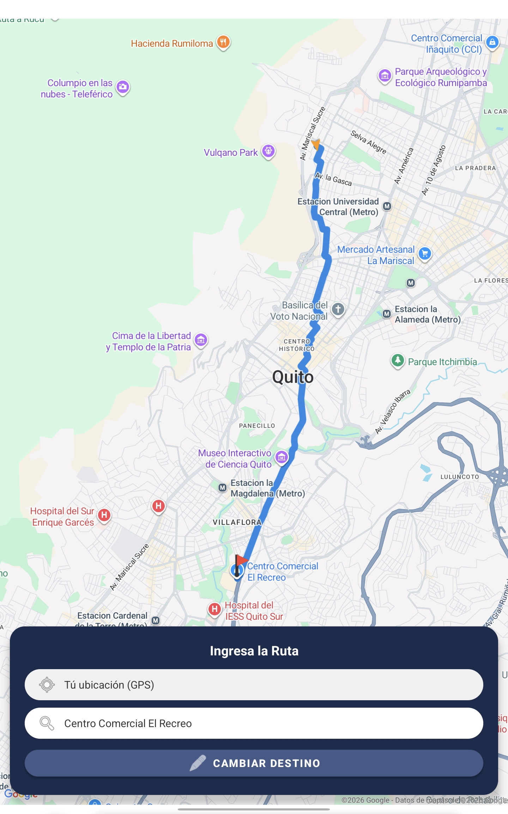
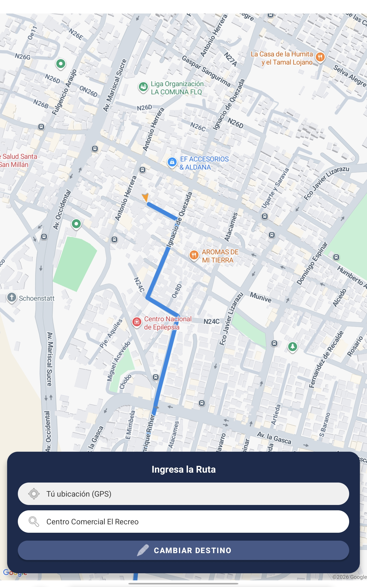
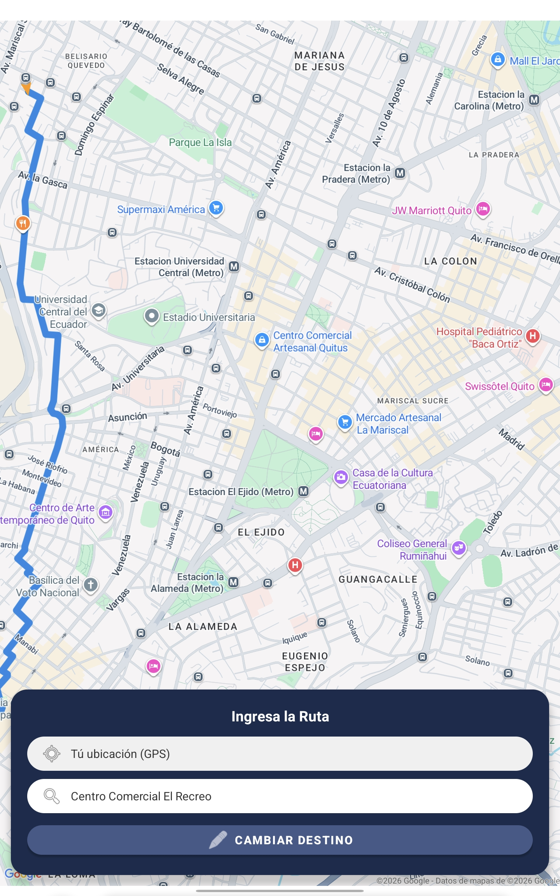

# CP-03: Renderizado de la ruta segura e interacción gestual

## 1. Definición del Caso de Prueba

| Campo | Descripción |
| :--- | :--- |
| **ID** | CP-03 |
| **Historia de Usuario** | HU-03 |
| **Nombre** | Renderizado de la ruta segura e interacción gestual |
| **Cumple (Sí/No)** | Sí |
| **Descripción de la Prueba** | Verificar que la ruta obtenida se grafique de forma clara sobre el mapa de Kotlin y que el usuario pueda aplicar zoom y desplazarse sin perder el trazado. |
| **Precondiciones** | El cálculo de la ruta (CP-02) fue exitoso. |
| **Datos de Prueba** | Trazado GeoJSON en memoria de la aplicación. |
| **Resultados Esperados** | Una línea continua y visible resalta la ruta segura sobre las calles. El mapa responde fluidamente a los gestos sin que la línea se distorsione o desaparezca. |
| **Resultados Obtenidos** | Renderizado fluido en el dispositivo de prueba. Los gestos de zoom y paneo no presentaron latencia ni errores gráficos. |

---

## 2. Evidencia de Ejecución

**Paso 1:** Observar la ruta generada.

**Paso 2:** Realizar gestos de "pellizco" para acercar y alejar el mapa.

**Paso 3:** Arrastrar el mapa para desplazar la vista.

