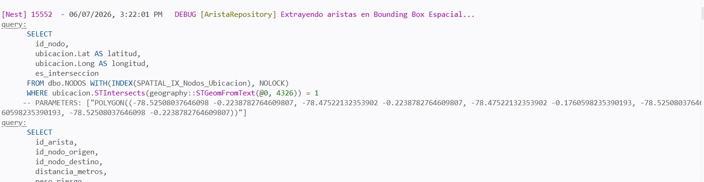
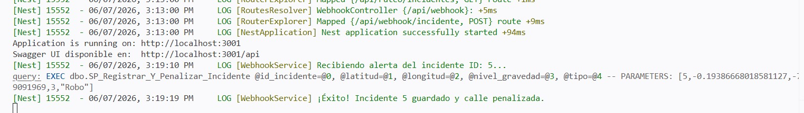
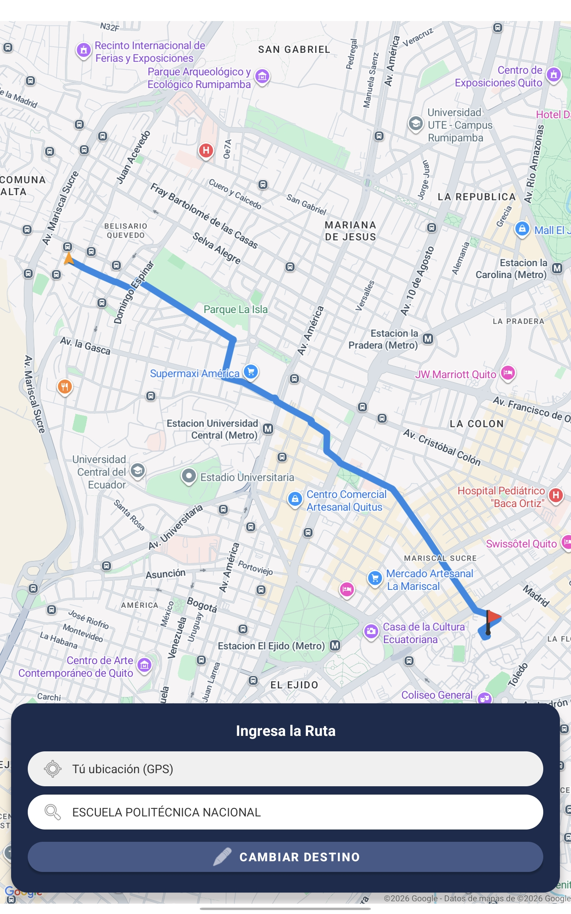
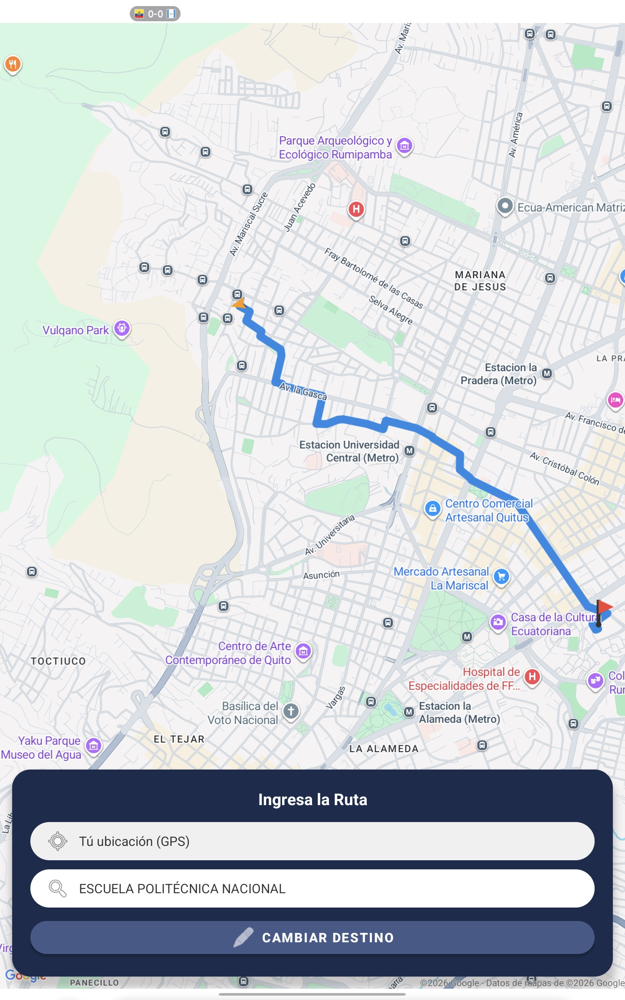

# CP-04: Aplicación de pesos de seguridad en el algoritmo de ruteo

## 1. Definición del Caso de Prueba

| Campo | Descripción |
| :--- | :--- |
| **ID** | CP-04 |
| **Historia de Usuario** | HU-04 |
| **Nombre** | Aplicación de pesos de seguridad en el algoritmo de ruteo |
| **Cumple (Sí/No)** | Sí |
| **Descripción de la Prueba** | Verificar que el algoritmo en Nest.js asigne y evalúe correctamente los pesos de peligrosidad a los nodos y aristas de la red vial, priorizando un camino más largo pero seguro. |
| **Precondiciones** | La base de datos (SQL Server) tiene dos caminos posibles entre el origen y el destiono: el caso 1 es corto, pero atraviesa un nodo marcado como "Riesgo Alto", el caso 2 es más largo, pero con "Riesgo Cero". |
| **Datos de Prueba** | Origen   Destino   Pesos de prueba simulados en la base de datos. |
| **Resultados Esperados** | El algoritmo de ruteo discrimina el caso 1 debido a su alta ponderación de riesgo y devuelve el trazado correspondiente al caso 2. |
| **Resultados Obtenidos** | El servicio en Nest.js calculó la ruta penalizando correctamente las zonas de riesgo. |

---

## 2. Evidencia de Ejecución

**Paso 1:** Enviar una petición HTTP al endpoint de ruteo en el backend con las coordenadas de los origen y destino.

**Paso 2:** Analizar el objeto GeoJSON de respuesta.

**Ruta sin incidente**

**Ruta con incidente**
