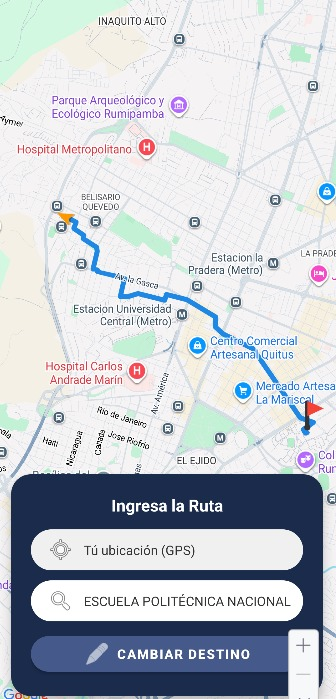
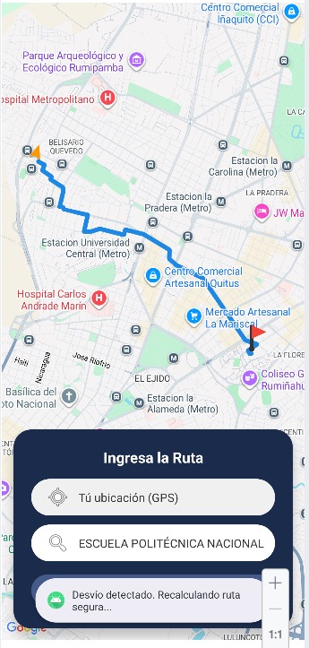
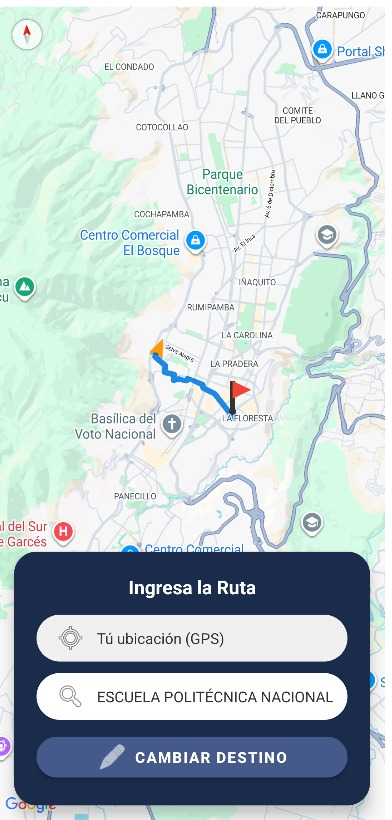
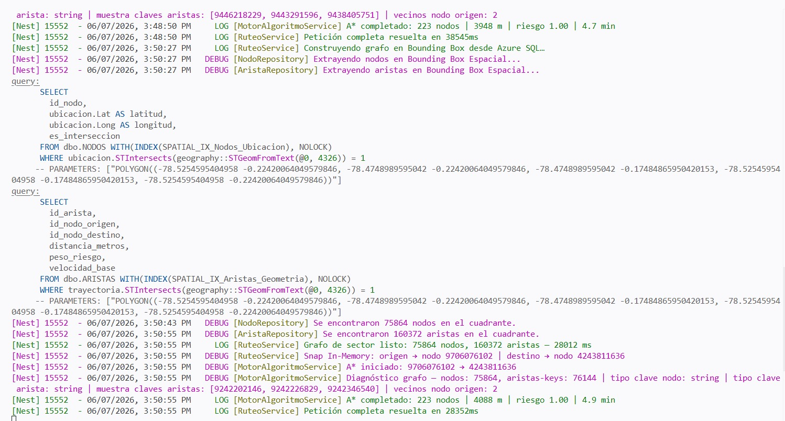

# CP-05: Detección de desviación y recálculo automático

## 1. Definición del Caso de Prueba

| Campo | Descripción |
| :--- | :--- |
| **ID** | CP-05 |
| **Historia de Usuario** | HU-05 |
| **Nombre** | Detección de desviación y recálculo automático |
| **Cumple (Sí/No)** | Sí |
| **Descripción de la Prueba** | Comprobar que, si el usuario se aleja de la ruta segura trazada inicialmente superando un margen de tolerancia definido, la aplicación móvil detecte el desvío y solicite automáticamente un recálculo desde su nueva posición. |
| **Precondiciones** | Una ruta segura está activa en la interfaz (Kotlin). Los servicios de ubicación GPS del dispositivo están habilitados y simulando movimiento. |
| **Datos de Prueba** | Ruta activa. Nueva coordenada GPS: Fuera del radio de tolerancia de la ruta calculada. |
| **Resultados Esperados** | La aplicación en Kotlin detecta que la distancia entre la ubicación actual y el polígono de la ruta supera el umbral, dispara una nueva petición al backend y actualiza el mapa con la nueva ruta segura. |
| **Resultados Obtenidos** | El evento de desvío fue capturado exitosamente por el ViewModel en Kotlin. El recálculo se ejecutó y el mapa se actualizó con la nueva trayectoria de forma asíncrona. |

---

## 2. Evidencia de Ejecución

**Paso 1:** Iniciar la navegación de una ruta segura generada.

**Paso 2:** Simular un cambio en las coordenadas GPS del dispositivo, alejándolo más de 50 metros del trazado original.

**Paso 3:** Observar el comportamiento de la interfaz y las peticiones de red.

**Ruta con desvío**

**Consola Ejecución**

