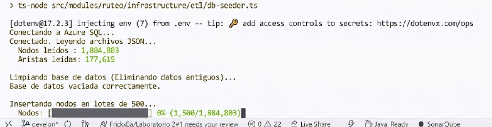
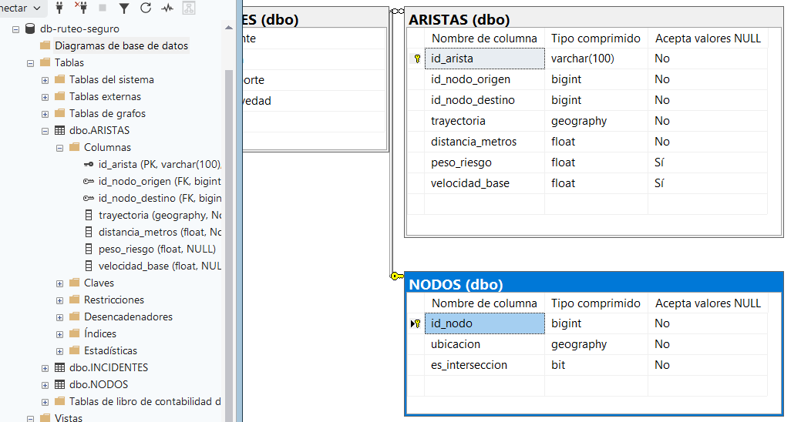

# CP-06: Ingesta y estructuración espacial en base de datos

## 1. Definición del Caso de Prueba

| Campo | Descripción |
| :--- | :--- |
| **ID** | CP-06 |
| **Historia de Usuario** | HU-06 |
| **Nombre** | Ingesta y estructuración espacial en base de datos |
| **Cumple (Sí/No)** | Sí |
| **Descripción de la Prueba** | Validar que el proceso de carga de la red vial transforme correctamente los datos geográficos crudos en una estructura de grafos con tipos de datos espaciales dentro de la base de datos relacional. |
| **Precondiciones** | Archivos fuente de la red vial de Quito disponibles en formato osm. Conexión activa a SQL Server en Azure con soporte espacial activado. |
| **Datos de Prueba** | Archivo vectorial con un sector delimitado de Quito para prueba de carga controlada. |
| **Resultados Esperados** | El script procesa y almacena los datos sin errores. La base de datos refleja las tablas de nodos y aristas pobladas mediante el tipo de dato GEOGRAPHY nativo de SQL Server. |
| **Resultados Obtenidos** | La ingesta finalizó en el tiempo estimado. Las consultas espaciales en SQL Server sobre los datos cargados se ejecutaron correctamente y devolvieron geometrías válidas. |

---

## 2. Evidencia de Ejecución

**Paso 1:** Ejecutar el script o servicio de Nest.js encargado de parsear y cargar los datos viales.

**Paso 2:** Consultar directamente en SQL Server la cantidad de registros y la validez de las geometrías insertadas.

